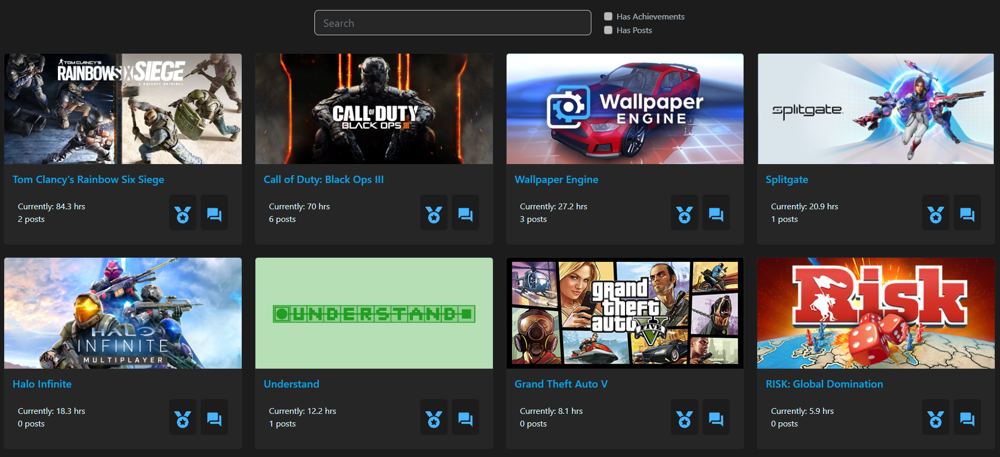
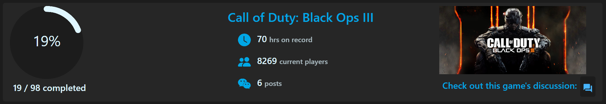
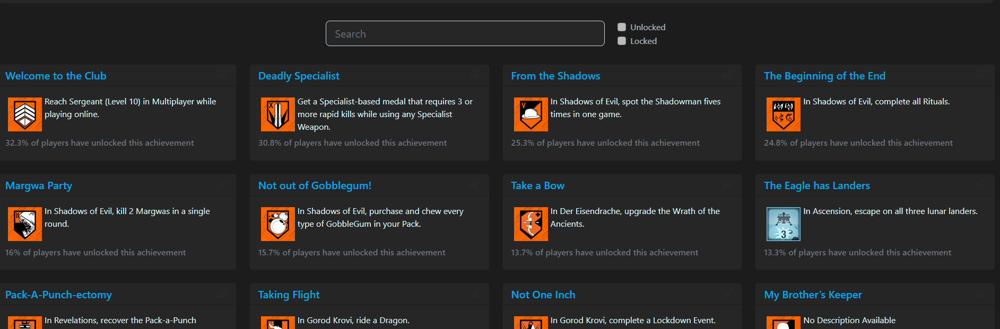
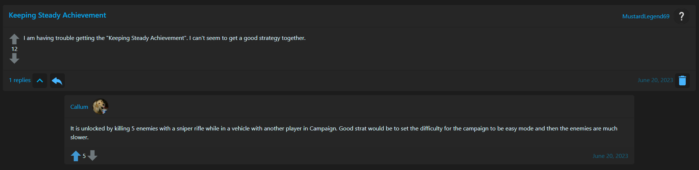
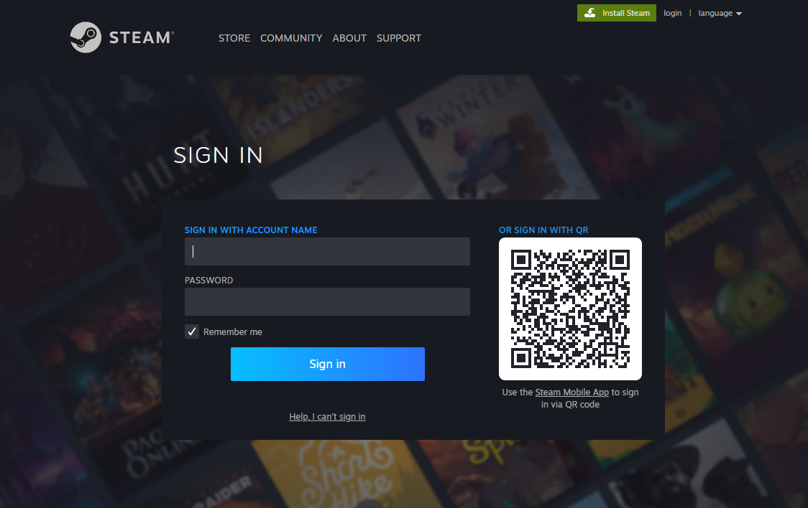
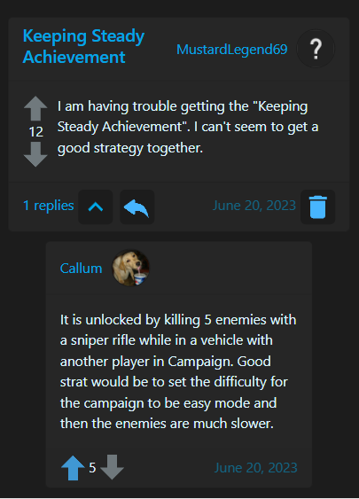

# Stats For Steam

Stats For Steam provides Steam users with the ability to view their achievements and track their progress. Additionally, the platform allows users to engage in discussions related to these achievements.

## Features
- Game Display: Users can see the games they have and filter them down with a search and checkboxes.

  
- View Your Achievements: Users can see the achievements they have earned as well as the ones they have yet to unlock.
 

- Game Discussions: Users can participate in discussions related to specific achievements, allowing them to share tips, strategies, and experiences with other players.

- User Authentication: The application supports user authentication, ensuring that only registered Steam accounts can access and interact with the platform.

- Responsive Design: The website is designed to be responsive and provide an optimal viewing experience across different devices and screen sizes.

## Tech Stack

- Frontend: React, Bootstrap, SCSS
- Backend: Flask (Python)
- Database: MySQL
- Hosting: AWS, NGINX, Gunicorn

## Contact

For any inquiries or questions, please contact our team at statsforsteam@gmail.com

Happy gaming!
